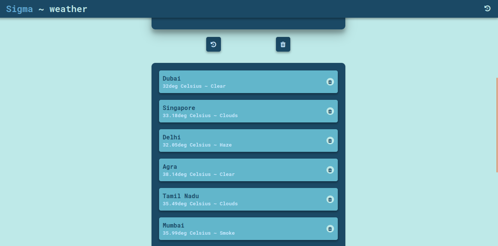

# weather_app1
  Weather_app1 is a weather web application. It will get the city name from the user and display the temperature, weather, wind speed of the given city. It was developed by using HTML5, CSS3, and Javascript ES6. Data of the city store as a history in local storage. It permits the user to clear the data in the local storage.

## Preview
### weather_app1 dashboard

### weather_app1 history

## Requirement:
Add you API Key at (js/script.js (line 35) )

35. let API_key = "(YOUR API KEY)";
